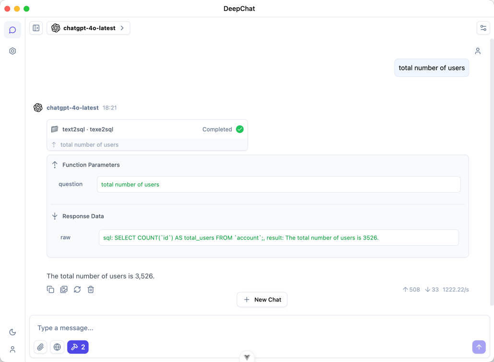
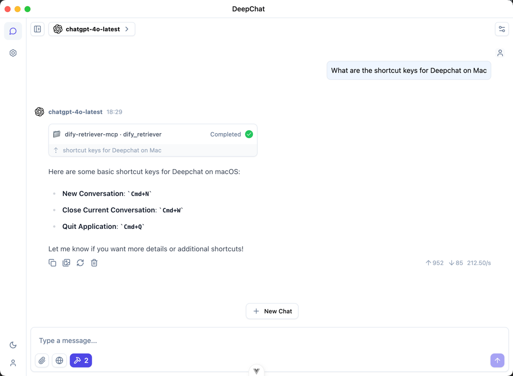
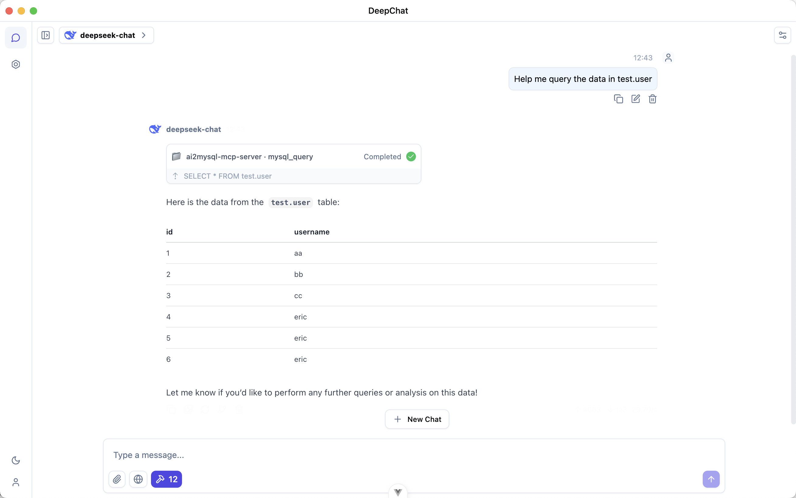
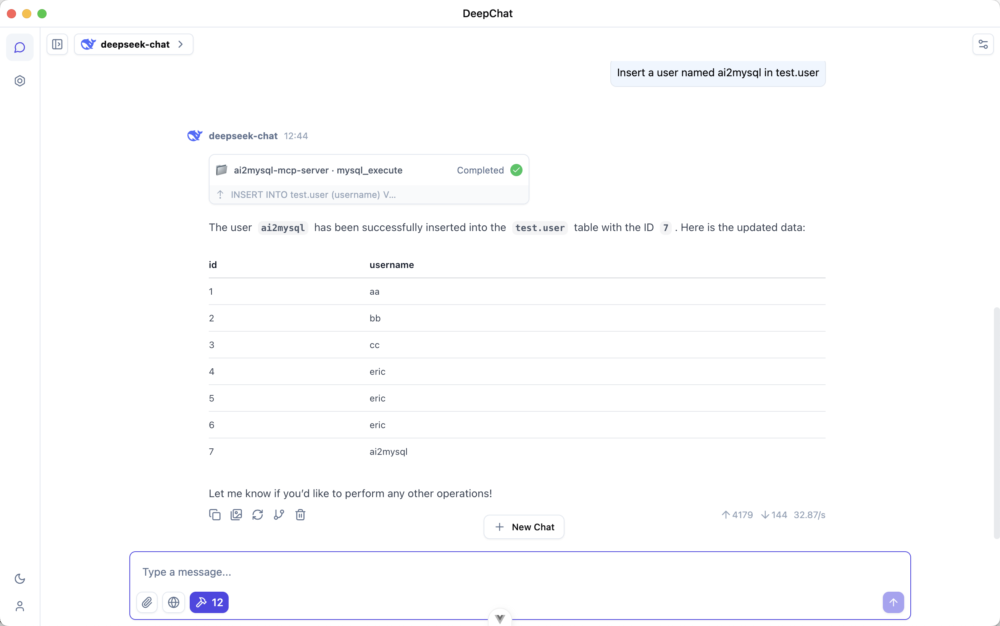

# Go MCP Server List

This repository provides a curated list of Model Context Protocol (MCP) servers implemented in Go. You can use these servers as references or starting points for your own AI context integration projects.

## Contributing

Feel free to contribute by either:
- Adding a link to your repository in this README

If adding a package directly, please create a `README.md` inside with author information.

## Server List

<!-- Add repository links here -->
+ [text2sql](#text2sql)
+ [dify-retriever](#dify-retriever)
+ [ai2mysql-mcp-server](#ai2mysql-mcp-server)

### text2sql

<table>
<tr><th align="left">GitHub</th><td>https://github.com/wangle201210/mcp-server</td></tr>
<tr><th align="left">Website</th><td>/</td></tr>
<tr><th align="left">License</th><td>MIT</td></tr>
<tr><th align="left">Type</th><td>stdio</td></tr>
<tr><th align="left">Platforms</th><td>Windows, MacOS, Linux</td></tr>
<tr><th align="left">Pricing</th><td>Free</td></tr>
<tr><th align="left">Programming Languages</th><td>GO</td></tr>
</table>

text2sql is a natural language to SQL query service based on the go-mcp framework, supporting the conversion of natural language questions into executable SQL statements and returning query results.

Screenshots

### dify-retriever

<table>
<tr><th align="left">GitHub</th><td>https://github.com/wangle201210/mcp-server</td></tr>
<tr><th align="left">Website</th><td>/</td></tr>
<tr><th align="left">License</th><td>MIT</td></tr>
<tr><th align="left">Type</th><td>stdio</td></tr>
<tr><th align="left">Platforms</th><td>Windows, MacOS, Linux</td></tr>
<tr><th align="left">Pricing</th><td>Free</td></tr>
<tr><th align="left">Programming Languages</th><td>GO</td></tr>
</table>

dify-retriever-mcp, using the knowledge base to make AI answers more in line with expectations

Screenshots

### ai2mysql-mcp-server

<table>
<tr><th align="left">GitHub</th><td>https://github.com/blanplan-ai/ai2mysql-mcp-server</td></tr>
<tr><th align="left">Website</th><td>/</td></tr>
<tr><th align="left">License</th><td>MIT</td></tr>
<tr><th align="left">Type</th><td>stdio</td></tr>
<tr><th align="left">Platforms</th><td>Windows, MacOS, Linux</td></tr>
<tr><th align="left">Pricing</th><td>Free</td></tr>
<tr><th align="left">Programming Languages</th><td>GO</td></tr>
</table>

ai2mysql-mcp-server is a MySQL database connection server built on go-mcp, supporting communication with clients via stdio, allowing execution of SQL queries and data manipulation operations.

Screenshots

## Maintenance

Each author is responsible for maintaining their own code. However, if you submit a package directly to this repository, you allow the community to fix and improve it. You can also submit pull requests to fix existing packages.

## License

Please see individual packages for license information.